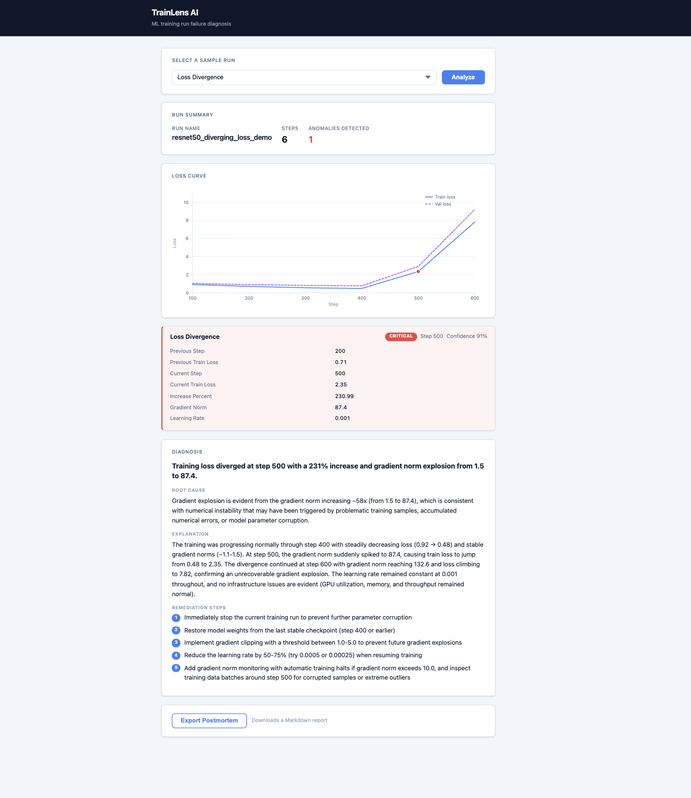
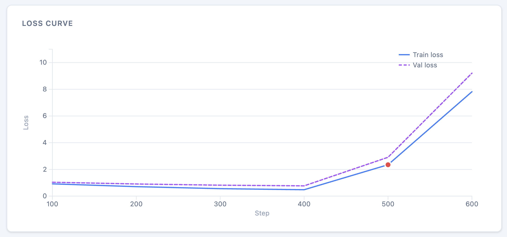
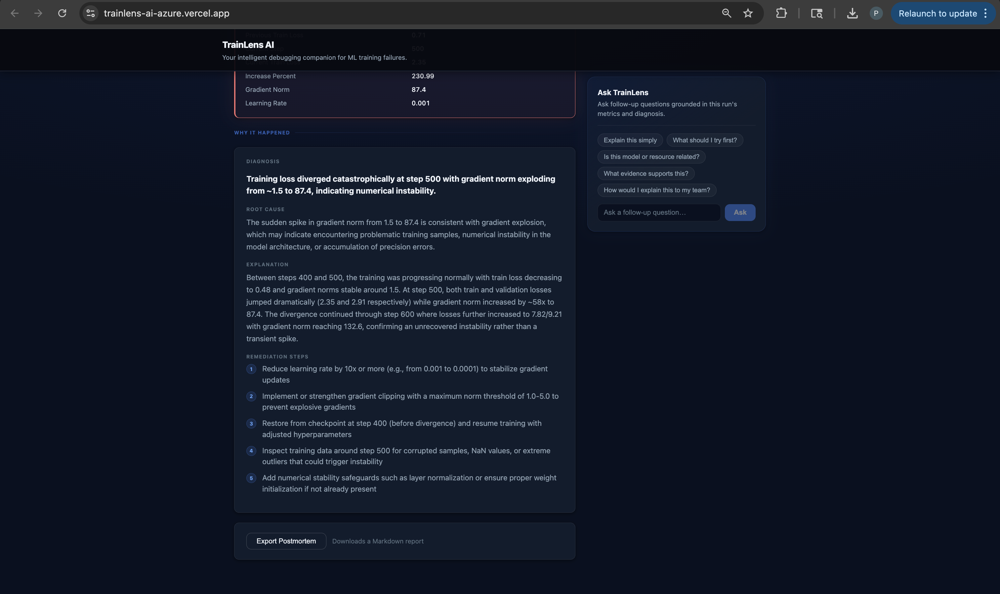
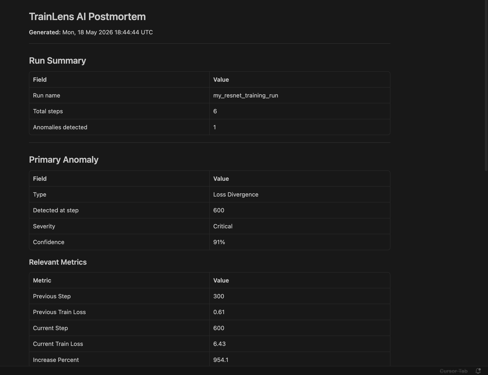
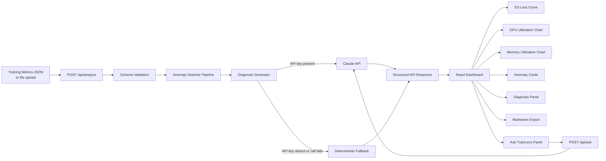

# TrainLens AI

**AI-assisted ML training run failure diagnosis.**

**[Live demo →](https://trainlens-ai-azure.vercel.app/)**

TrainLens AI is a lightweight diagnostic layer for ML training runs. It accepts training metrics, detects failure patterns such as loss divergence, vanishing gradients, and OOM risk, and returns structured root-cause analysis with remediation steps — optionally powered by Claude.

> **Portfolio note:** This is a working MVP, not a production observability platform. It does not replace W&B, MLflow, or similar tools. It demonstrates an end-to-end AI-assisted diagnosis pipeline built with FastAPI, React, D3, and the Anthropic API.

---

## Screenshots


| Dashboard | Loss curve |
|---|---|
|  |  |

| Diagnosis panel | Postmortem export |
|---|---|
|  |  |

---

## Features

- **5 anomaly detectors** — rule-based, deterministic, no model required
- **Claude-powered diagnosis** — structured root-cause analysis via the Anthropic API; gracefully falls back to deterministic diagnosis when the API key is absent or the call fails
- **Ask TrainLens Q&A** — follow-up question panel grounded in the run's metrics and diagnosis; Claude-powered with fallback
- **JSON file upload** — upload your own training metrics JSON in the same format as the sample logs
- **D3 loss curve** — train/validation loss chart with severity-colored anomaly markers
- **GPU utilization chart** — D3 chart with 50% underutilization threshold line and anomaly markers
- **Memory utilization chart** — D3 area chart with 90% OOM risk threshold line and anomaly markers
- **Cross-highlighting** — click an anomaly card or chart marker to keep the selected anomaly in focus across all charts
- **Diagnosis panel** — headline, root cause, explanation, and numbered remediation steps
- **Markdown postmortem export** — one-click download of a structured incident report
- **Unified data source selector** — tab toggle between sample runs and JSON file upload; mutually exclusive, always shows what will be analyzed
- **Premium dark UI** — sticky header, mentor-style animated loading card, two-column layout with sticky Ask TrainLens sidebar
- **Full type safety** — Pydantic models on the backend, TypeScript interfaces on the frontend

---

## Detected anomaly types

| Anomaly | Key | Severity | Detection rule |
|---|---|---|---|
| Loss Divergence | `loss_divergence` | critical | `train_loss` increases >200% compared with the metric three positions earlier |
| Vanishing Gradients | `vanishing_gradients` | warning | `gradient_norm` < 0.001 for 5+ consecutive metrics |
| GPU Underutilization | `gpu_underutilization` | warning | `gpu_utilization_percent` < 50 for 5+ consecutive metrics |
| OOM Risk | `oom_risk` | critical | `memory_used_gb / memory_total_gb` ≥ 0.90 at any step |
| Training Stall | `training_stall` | warning | `val_loss` changes < 0.001 across 5+ consecutive logged intervals |

---

## Architecture



---

## Tech stack

| Layer | Technology |
|---|---|
| Backend | Python 3.12, FastAPI, Pydantic v2, uv |
| AI | Anthropic Python SDK (`claude-sonnet-4-5` by default) |
| Frontend | React 18, TypeScript, Vite |
| Visualisation | D3.js v7 |
| Testing | pytest (backend), `tsc --noEmit` + Vite build (frontend) |
| Deployment | Railway (backend), Vercel (frontend) |

---

## Quick start

### 1. Clone

```bash
git clone https://github.com/agarwalpragya/trainlens-ai.git
cd trainlens-ai
```

### 2. Backend

```bash
cd backend
uv sync
uv run uvicorn app.main:app --reload
```

API available at `http://localhost:8000`.
Interactive docs at `http://localhost:8000/docs`.

### 3. Frontend

Open a second terminal from the repo root:

```bash
cd frontend
npm install
npm run dev
```

Dashboard available at `http://localhost:5173`.

### 4. Claude diagnosis (optional)

Create `backend/.env`:

```env
ANTHROPIC_API_KEY=sk-ant-...
ANTHROPIC_MODEL=claude-sonnet-4-5
```

If `ANTHROPIC_API_KEY` is not set, the backend returns deterministic rule-based diagnosis automatically. No configuration is required to run without it.

---

## Environment variables

| Variable | Location | Default | Description |
|---|---|---|---|
| `ANTHROPIC_API_KEY` | `backend/.env` | _(empty)_ | Anthropic API key. Omit to use deterministic fallback. |
| `ANTHROPIC_MODEL` | `backend/.env` | `claude-sonnet-4-5` | Claude model used for diagnosis. |
| `VITE_API_BASE_URL` | `frontend/.env` | `http://localhost:8000` | Backend base URL for the frontend API client. |

---

## Sample logs

Six pre-built payloads are included in `sample_logs/`. Run from the **repo root**:

| File | Anomaly triggered |
|---|---|
| `diverging_run.json` | `loss_divergence` |
| `vanishing_gradients.json` | `vanishing_gradients` |
| `gpu_underutilized.json` | `gpu_underutilization` |
| `oom_risk.json` | `oom_risk` |
| `training_stall.json` | `training_stall` |
| `normal_run.json` | none |

---

## API example

### Request

```bash
curl -X POST http://localhost:8000/api/analyze \
  -H "Content-Type: application/json" \
  -d @sample_logs/diverging_run.json
```

### Response

```json
{
  "run_name": "resnet50_diverging_loss_demo",
  "summary": {
    "total_steps": 6,
    "anomalies_detected": 1
  },
  "anomalies": [
    {
      "anomaly_type": "loss_divergence",
      "detected_at_step": 500,
      "severity": "critical",
      "confidence": 0.91,
      "relevant_metrics": {
        "previous_step": 200,
        "previous_train_loss": 0.71,
        "current_step": 500,
        "current_train_loss": 2.35,
        "increase_percent": 230.99,
        "gradient_norm": 87.4,
        "learning_rate": 0.001
      },
      "context_window": ["..."]
    }
  ],
  "diagnosis": {
    "headline": "Training run likely diverged due to unstable optimization.",
    "root_cause": "Training loss increased sharply near step 500, suggesting unstable optimization behavior.",
    "explanation": "A sudden loss spike may indicate an overly high learning rate, exploding gradients, or unstable batch data.",
    "remediation_steps": [
      "Reduce the learning rate and rerun from the last stable checkpoint.",
      "Inspect gradient norm around the failure step.",
      "Check whether a specific data batch caused the spike.",
      "Enable gradient clipping if exploding gradients are suspected."
    ]
  }
}
```

Full request/response schema: [`docs/API_SPEC.md`](docs/API_SPEC.md)

---

## Testing

### Backend

```bash
cd backend
uv run pytest -v
```

34 tests covering all five detectors, edge cases, Claude diagnosis fallback paths, Ask TrainLens Q&A fallback paths, and deterministic diagnosis correctness.

### Frontend

```bash
cd frontend
npm run build
```

TypeScript compilation + Vite production build. No test framework is wired up yet — see [Roadmap](#roadmap).

---

## Current limitations

- Accepts up to the full request payload in a single POST call; no streaming or incremental ingestion.
- No authentication or multi-user support.
- No persistent storage; results exist only in the API response.
- Only one anomaly per detector type is reported per run (first occurrence wins).
- Claude diagnosis is based on the primary (first) anomaly only.
- File upload accepts JSON only; raw `.log`, `.csv`, and TensorBoard formats are not supported yet.

---

## Roadmap

| Status | Item |
|---|---|
| ✅ | FastAPI backend with 5 anomaly detectors |
| ✅ | Claude-powered diagnosis with deterministic fallback |
| ✅ | Ask TrainLens follow-up Q&A (POST /api/ask) |
| ✅ | React + D3 dashboard |
| ✅ | Markdown postmortem export |
| ✅ | Premium dark UI — sticky header, animated loading card, two-column layout |
| ✅ | Screenshots in README |
| ✅ | Demo GIF in README |
| ✅ | Frontend JSON file upload |
| ✅ | GPU utilization chart |
| ✅ | Memory utilization chart |
| ✅ | Unified data source card with tab toggle |
| ✅ | Deployed — backend on Railway, frontend on Vercel |
| ⬜ | Raw log / CSV parsing |
| ⬜ | Frontend unit tests |
| ⬜ | Chat history for Ask TrainLens |
| ⬜ | Authentication and persistent storage |

---

## Documentation

- [Architecture](docs/ARCHITECTURE.md)
- [API Specification](docs/API_SPEC.md)
- [Data Model](docs/DATA_MODEL.md)
- [Product Requirements](docs/PRD.md)
- [Architecture Decisions](docs/DECISIONS.md)
- [Roadmap](docs/ROADMAP.md)
