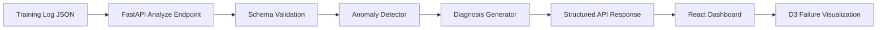
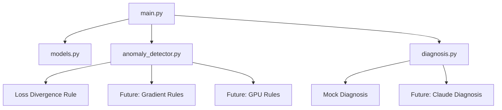
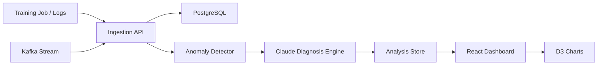

# TrainLens AI Architecture

## 1. System Overview

TrainLens AI analyzes ML training logs and detects training failure patterns.

The MVP is intentionally simple:

- FastAPI backend
- Sample JSON logs
- Rule-based anomaly detector
- Mock diagnosis generator
- React/D3 frontend later

## 2. High-Level Flow

## 3. Backend Components

## 4. MVP Architecture Decisions

- Use FastAPI for lightweight API development.
- Use uv for modern Python dependency management.
- Use rule-based detection before LLM diagnosis.
- Start with JSON logs instead of real-time streaming.
- Mock diagnosis before integrating Claude.
- Delay database until the core loop works.

## 5. Future Architecture

