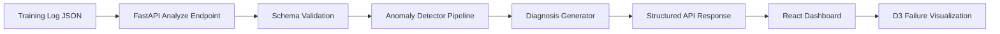
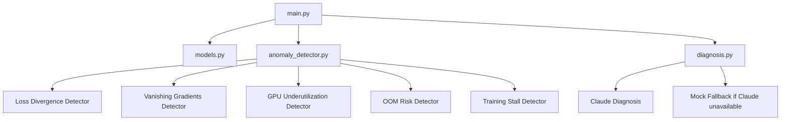
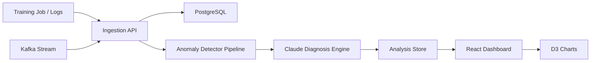

# TrainLens AI Architecture

## 1. System Overview

TrainLens AI analyzes ML training logs and detects training failure patterns.

The MVP backend is intentionally simple:

- FastAPI backend
- Sample JSON logs
- Rule-based anomaly detector pipeline
- Claude diagnosis with rule-based mock fallback
- React/D3 frontend

## 2. High-Level Flow

## 3. Backend Components

## 4. Anomaly Detector Pipeline

`detect_anomalies` in `anomaly_detector.py` runs all five detectors in sequence on the same sorted metric list and collects results.

Each detector:
- Receives the full sorted metric list.
- Returns one `Anomaly` object or `None`.
- Reports the first detected step for a given anomaly window to avoid duplicate reporting.
- Attaches a `context_window` of surrounding metrics for downstream diagnosis.

| Detector | Rule | Severity |
|---|---|---|
| `detect_loss_divergence` | train_loss increases >200% within a 3-step window | critical |
| `detect_vanishing_gradients` | gradient_norm < 0.001 for 5+ consecutive steps | warning |
| `detect_gpu_underutilization` | gpu_utilization_percent < 50 for 5+ consecutive steps | warning |
| `detect_oom_risk` | memory_used_gb / memory_total_gb ≥ 0.90 at any step | critical |
| `detect_training_stall` | val_loss changes by < 0.001 for 5+ consecutive steps | warning |

## 5. MVP Architecture Decisions

- Use FastAPI for lightweight API development.
- Use uv for modern Python dependency management.
- Run rule-based detection before LLM diagnosis to extract structured evidence first.
- Start with JSON logs instead of real-time streaming.
- Claude diagnosis with a rule-based mock fallback (active when `ANTHROPIC_API_KEY` is unset or Claude fails).
- Delay database until the core loop works.

## 6. Future Architecture

