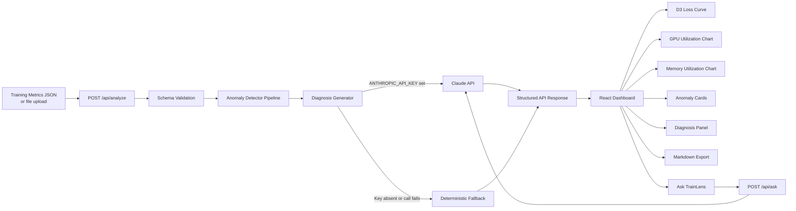
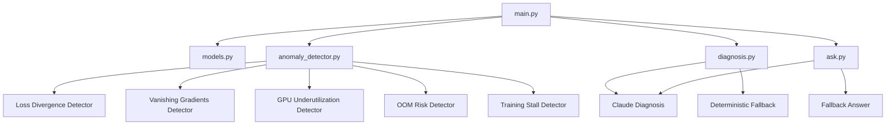
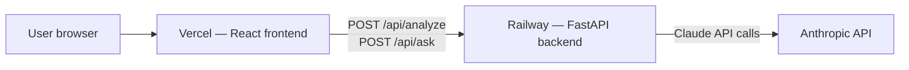
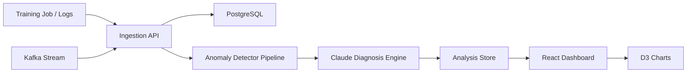

# TrainLens AI Architecture

## 1. System Overview

TrainLens AI analyzes ML training logs and detects training failure patterns.

The backend is intentionally simple:

- FastAPI backend
- Sample JSON logs (and user-uploaded JSON via the frontend)
- Rule-based anomaly detector pipeline
- Claude diagnosis with rule-based fallback
- Claude-powered follow-up Q&A with fallback
- React/D3 frontend with premium dark UI

Deployed on Railway (backend) and Vercel (frontend). Live at https://trainlens-ai-azure.vercel.app/

## 2. High-Level Flow

## 3. Backend Components

## 4. Anomaly Detector Pipeline

`detect_anomalies` in `anomaly_detector.py` runs all five detectors in sequence on the same sorted metric list and collects results.

Each detector:
- Receives the full sorted metric list.
- Returns one `Anomaly` object or `None`.
- Reports the first detected step for a given anomaly window to avoid duplicate reporting.
- Attaches a `context_window` of surrounding metrics (±10 steps) for downstream diagnosis.

| Detector | Rule | Severity |
|---|---|---|
| `detect_loss_divergence` | train_loss increases >200% within a 3-step window | critical |
| `detect_vanishing_gradients` | gradient_norm < 0.001 for 5+ consecutive steps | warning |
| `detect_gpu_underutilization` | gpu_utilization_percent < 50 for 5+ consecutive steps | warning |
| `detect_oom_risk` | memory_used_gb / memory_total_gb ≥ 0.90 at any step | critical |
| `detect_training_stall` | val_loss changes by < 0.001 for 5+ consecutive steps | warning |

## 5. Ask TrainLens Q&A Flow

`POST /api/ask` accepts a `question` string and the full `AnalyzeResponse` from a prior analyze call.

`ask.py` builds a structured prompt containing:
- Run name and summary statistics
- All detected anomalies with their severity, step, confidence, and relevant metrics
- The full diagnosis (headline, root cause, explanation, remediation steps)
- An instruction to answer only from the available evidence

The prompt is sent to Claude (`claude-sonnet-4-5` by default). If `ANTHROPIC_API_KEY` is absent or the call fails, a descriptive fallback message is returned instead of an error.

## 6. Frontend Components

| Component | Purpose |
|---|---|
| `DataSourceCard` | Unified data source selector — tab toggle between sample runs and JSON file upload; mutually exclusive modes, file parsing and validation included |
| `AnalysisLoadingCard` | Animated loading card with rotating status messages and educational facts |
| `AnalysisSummary` | Run name, total steps, and anomaly count stats |
| `LossCurveChart` | D3 loss curve (train + val) with clickable severity-colored anomaly markers |
| `GpuUtilizationChart` | D3 line chart showing GPU utilization % with a dashed 50% underutilization threshold and anomaly markers |
| `MemoryUsageChart` | D3 area+line chart showing memory utilization % with a dashed 90% OOM risk threshold and anomaly markers |
| `AnomalyCard` | Per-anomaly card with type, severity badge, step, confidence, and relevant metrics |
| `DiagnosisPanel` | Headline, root cause, explanation, and numbered remediation steps |
| `AskTrainLensCard` | Mentor Q&A panel — prompt chips, free-text input, Claude-powered answers |
| `ExportPostmortemButton` | One-click Markdown postmortem export |

The results view uses a two-column CSS Grid layout at ≥1080px: main content left, Ask TrainLens sidebar right (sticky). GPU and Memory charts sit in a two-column sub-grid within the main column. On narrow screens all columns collapse to single-column.

## 7. JSON File Upload Flow

The frontend handles file upload entirely client-side using the FileReader API — no upload endpoint exists on the backend.

1. User selects a `.json` file via the `DataSourceCard` upload tab.
2. `FileReader.readAsText` reads the file in-browser.
3. `validateTrainingRun` checks that the parsed object has a non-empty `run_name` and a non-empty `metrics` array where every step has at least `step` and `train_loss`.
4. If valid, the parsed payload replaces the sample run as the active data source.
5. Clicking Analyze sends the uploaded payload to `POST /api/analyze` — the same endpoint as sample runs.

## 8. Deployment Architecture

| Layer | Platform | Notes |
|---|---|---|
| Frontend | Vercel | Static build from `frontend/`. `VITE_API_BASE_URL` points to Railway. |
| Backend | Railway | Python 3.12 + FastAPI. `ANTHROPIC_API_KEY` and `ANTHROPIC_MODEL` set as env vars. |
| AI | Anthropic API | `claude-sonnet-4-5` by default. Falls back to deterministic if key is absent. |

CORS is configured on the FastAPI backend to accept requests from the Vercel frontend origin.

## 9. MVP Architecture Decisions

- Use FastAPI for lightweight API development.
- Use uv for modern Python dependency management.
- Run rule-based detection before LLM diagnosis to extract structured evidence first.
- Start with JSON logs instead of real-time streaming.
- Claude diagnosis with a rule-based fallback (active when `ANTHROPIC_API_KEY` is unset or Claude fails).
- Ask TrainLens Q&A passes the full `AnalyzeResponse` as context, avoiding a separate storage layer.
- File upload is handled client-side (FileReader) — no backend upload endpoint required.
- Delay database until the core loop is proven.

## 10. Future Architecture

